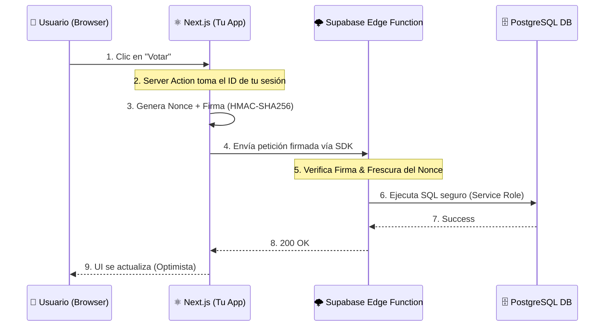

<div align="center">
  <h1>🌌 OpenFeedback Engine</h1>
  <p><b>La infraestructura de feedback "Headless" y sin login para el ecosistema moderno de Next.js.</b></p>
  <p>
    <a href="https://opensource.org/licenses/MIT"></a>
    <a href="https://www.typescriptlang.org/"></a>
    <a href="https://nextjs.org/"></a>
    <a href="https://supabase.com/"></a>
  </p>
  <p>
    <em>Deja de perder retención de usuarios con portales de feedback externos que requieren inicios de sesión separados.</em>
    <br/>
    <a href="./README.md">🇺🇸 Read in English</a>
  </p>
</div>

---

## 🚀 El Momento "Aha!"

**OpenFeedback Engine** no es otro portal de feedback. Es una infraestructura de código abierto diseñada para fundadores SaaS y desarrolladores independientes que desean integrar la recolección de feedback, votaciones y roadmaps directamente en sus aplicaciones.

**El Problema con las herramientas tradicionales:**
- **Fricción de Usuario:** Obligar a los usuarios a registrarse en portales externos reduce drásticamente la participación (a menudo a <5%).
- **Incoherencia Visual:** Los iframes y embebidos rompen la experiencia de usuario y la identidad de tu marca.
- **Riesgos de Privacidad:** Almacenar datos en plataformas de terceros centralizadas complica el cumplimiento del **GDPR**.
- **Desconexión del Flujo:** El feedback vive en un silo, desconectado de tu flujo de trabajo de Git y despliegues.

**Nuestra Solución:**
Un sistema **Headless** y **Self-Hosted**. OpenFeedback funciona como un conjunto de primitivas (SDKs y APIs) que se integran en Next.js App Router, utilizando **firmas criptográficas HMAC** para validar acciones en el edge de forma segura, permitiendo a tus usuarios aportar feedback sin salir de tu SaaS.

## ✨ Características Clave

- **Cero Fricción ("No-Login")** 🚫 Deja que tus usuarios voten y sugieran dentro de tu SaaS. Sin magic links de terceros, sin cuentas separadas.
- **Autenticación Firmada sin Estado** 🔐 Autenticación criptográfica sin almacenamiento de sesión mediante firmas HMAC-SHA256. El backend valida en el edge.
- **Bóveda Seudónima (Vault)** 🛡️ Privacidad GDPR-first. Los votos son públicos y anónimos; los emails se cifran y guardan aislados para notificaciones.
- **Headless por Diseño** 🎨 Control total de UI. Usa nuestros componentes (Radix/Tailwind) o diseña el tuyo con hooks puros (`useVote`, `useSuggestions`).
- **Soberanía de Datos (Self-Hosted)** 🏠 Tus datos son tuyos. Funciona directamente sobre tu instancia de Supabase con RLS habilitado.

## 🏗️ Cómo Funciona (Arquitectura)

OpenFeedback soluciona el problema de los "votos falsos" sin requerir sesiones de usuario, delegando la confianza a tu Servidor Next.js seguro.

Al hacer clic en "Votar", un Server Action de Next.js firma la petición criptográficamente. Nuestra Edge Function en Supabase verifica esta firma y un `nonce` único antes de registrar el voto en PostgreSQL.



## ⚡ Guía Rápida (Next.js App Router)

Instala los paquetes en tu proyecto:
```bash
npm install @openfeedback/react @openfeedback/client
```

Envuelve tu página o layout con el contexto:
```tsx
// app/feedback/page.tsx
import { OpenFeedbackProvider, FeedbackBoard } from "@openfeedback/react";
import { signVoteRequest } from "@/actions/openfeedback"; // Tu server action

export default async function FeedbackPage() {
  const user = await getCurrentUser();
  const signatureData = await signVoteRequest(user.id);
  
  return (
    <OpenFeedbackProvider
      config={{ projectId: "...", apiUrl: "https://your-project.supabase.co" }}
      anonKey="sb-anon-key"
      authContext={{
        userId: user.id,
        signature: signatureData.signature,
        timestamp: signatureData.timestamp,
        nonce: signatureData.nonce,
      }}
    >
      <FeedbackBoard />
    </OpenFeedbackProvider>
  );
}
```

## 📦 Estructura del Monorepo

- **`packages/@openfeedback/client`**: Lógica central y firmas criptográficas.
- **`packages/@openfeedback/react`**: SDK de React con `<OpenFeedbackProvider>`, Hooks y Componentes Base.
- **`apps/saas-starter`**: 🟢 **Plantilla lista para Vercel:** Dashboard SaaS B2B usando Next.js 15 y Tailwind 4 con OpenFeedback pre-integrado.
- **`apps/demo-app`**: Implementación de referencia.

## 🗺️ Estado del Proyecto

- ✅ **Fase 1:** Configuración inicial (Turborepo).
- ✅ **Fase 2:** Motor Core (PostgreSQL, RLS, Edge Functions, React Hooks).
- ✅ **Fase 3:** Web Dashboard & Demo App.
- ✅ **Fase 4:** CLI & Changelog Generation.
- ✅ **Fase 5:** Ecosistema (Webhooks, integraciones).

## 📄 Licencia

Este proyecto está bajo la [Licencia MIT](LICENSE).
