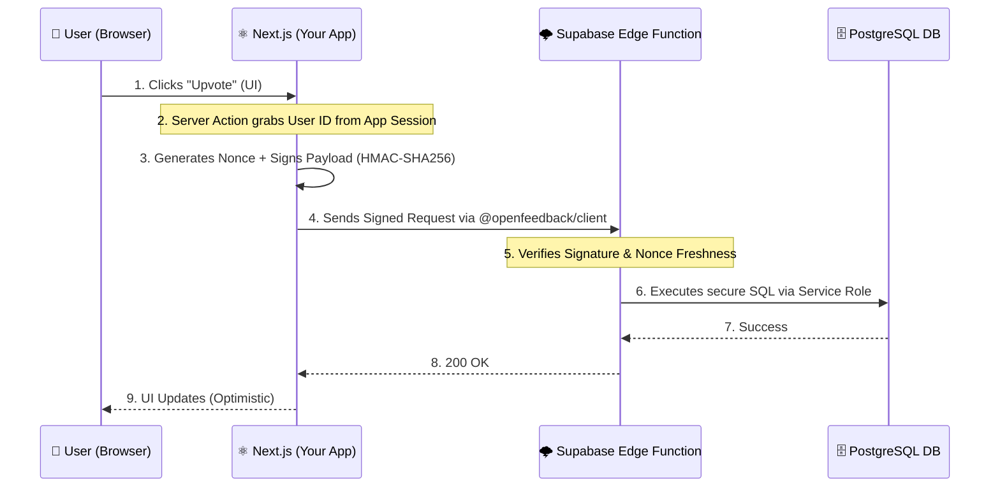

<div align="center">
  <h1>🌌 OpenFeedback Engine</h1>
  <p><b>The Headless, Stateless, No-Login Feedback Infrastructure for the Modern Next.js Ecosystem.</b></p>
  <p>
    <a href="https://opensource.org/licenses/MIT"></a>
    <a href="https://www.typescriptlang.org/"></a>
    <a href="https://nextjs.org/"></a>
    <a href="https://supabase.com/"></a>
  </p>
  <p>
    <em>Stop sacrificing user retention with third-party feedback portals that require a separate login.</em>
    <br/>
    <a href="./README.es.md">🇪🇸 Leer en Español</a>
  </p>
</div>

---

## 🚀 The "Aha!" Moment

**OpenFeedback Engine** is an open-source infrastructure designed for SaaS founders and independent developers who want to integrate feedback collection, voting, and roadmaps directly into their applications. 

**The Problem with traditional tools:**
- **User Friction:** Forcing users to register on external portals (like Canny) drastically reduces participation (often to <5%).
- **Visual Inconsistency:** Embeds and iframes break your carefully crafted user experience.
- **Privacy Risks:** Storing user data in centralized third-party platforms complicates GDPR compliance.
- **Workflow Disconnect:** Feedback sits in a silo, detached from your Git workflow and shipping cycle.

**Our Solution:**
OpenFeedback operates as a set of developer-first primitives (SDKs and APIs) that integrate seamlessly into your Next.js App Router. It uses **cryptographic HMAC signatures** to secure actions on the edge, enabling your users to vote and comment directly inside your SaaS, with zero friction and total control over data sovereignty.

## ✨ Key Features & USP

- **Zero-Friction "No-Login"** 🚫 Let your users vote and suggest while remaining inside your SaaS. No magic links, no separate accounts.
- **Signed Stateless Auth** 🔐 Cryptographic authentication without session storage via HMAC-SHA256 signatures. Your backend validates every action at the edge.
- **Pseudonymous Vault** 🛡️ GDPR-first privacy. Public votes are anonymous; user identities (like emails) are encrypted and stored in an isolated Supabase vault for just-in-time notifications.
- **Headless by Design** 🎨 Full UI control. Use our drop-in Radix/Tailwind components or build your own with unstyled hooks (`useVote`, `useSuggestions`).
- **Self-Hosted Data Sovereignty** 🏠 You own the data. Runs directly on your Supabase instance with Row Level Security (RLS) enabled.

## 🏗️ How it Works (Architecture)

OpenFeedback solves the "fake vote" problem without sessions by delegating trust to your trusted Server Context. 

When a user in your App clicks "Upvote", your Next.js Server Action signs a cryptographic payload with a secret key. Our Supabase Edge Function verifies this signature and a unique `nonce` before safely interacting with the database.



## ⚡ Quick Start (Next.js App Router)

### Prerequisites
- Node.js >= 20
- A Supabase Project

### 1. Installation
Install the core packages:
```bash
npm install @openfeedback/react @openfeedback/client
```

### 2. Configure the Provider
Wrap your layout or page with the required context. The `authContext` is generated server-side.

```tsx
// app/feedback/page.tsx
import { OpenFeedbackProvider, FeedbackBoard } from "@openfeedback/react";
import { signVoteRequest } from "@/actions/openfeedback"; // Your server action

export default async function FeedbackPage() {
  const user = await getCurrentUser();
  const signatureData = await signVoteRequest(user.id);
  
  return (
    <OpenFeedbackProvider
      config={{ projectId: "...", apiUrl: "https://your-project.supabase.co" }}
      anonKey="sb-anon-key"
      authContext={{
        userId: user.id,
        signature: signatureData.signature,
        timestamp: signatureData.timestamp,
        nonce: signatureData.nonce,
      }}
    >
      <FeedbackBoard />
    </OpenFeedbackProvider>
  );
}
```

*For more details, see the [Integration Guide](./docs/guides/integration.md).*

---

## 📦 Monorepo Structure

- **`packages/@openfeedback/client`**: Core logic and Server Side Signer algorithms.
- **`packages/@openfeedback/react`**: React SDK containing Providers, Hooks (`useVote`), and UI components.
- **`packages/@openfeedback/cli`**: The setup CLI.
- **`apps/saas-starter`**: 🟢 **Push-to-Deploy Template:** A complete generic B2B SaaS dashboard using Next.js 15, Tailwind 4, and OpenFeedback.
- **`apps/demo-app`**: Reference implementation showcasing the SDK.
- **`apps/web-dashboard`**: Administrative portal to manage suggestions.

## 🗺️ Project Status & Roadmap

- ✅ **Phase 1:** Scaffold (Turborepo setup, shared configs)
- ✅ **Phase 2:** Core Engine (PostgreSQL Schema, RLS, Edge Functions, React Hooks)
- ⏳ **Phase 3:** Demo App & Ecosystem (Next.js implementations)

## 📄 License & Commercial

The core engine and SDKs are licensed under the [MIT License](LICENSE).