<div align="center">
  <h1>🌌 OpenFeedback Engine</h1>
  <p><b>The Headless, Stateless, No-Login Feedback Infrastructure for the Modern Next.js Ecosystem.</b></p>
  <p>
    <a href="https://opensource.org/licenses/MIT"></a>
    <a href="https://www.typescriptlang.org/"></a>
    <a href="https://nextjs.org/"></a>
    <a href="https://supabase.com/"></a>
  </p>
  <p>
    <em>Stop sacrificing user retention with third-party feedback portals that require a separate login.</em>
  </p>
</div>

---

## 🚀 The "Aha!" Moment

**OpenFeedback Engine** is an open-source infrastructure designed for SaaS founders and developers who want to integrate feedback collection, voting, and roadmaps directly into their applications without forcing users to create external accounts or breaking the visual identity of their product.

Unlike monolithic solutions (Canny, Jira Product Discovery), OpenFeedback operates as a set of primitives (SDKs and APIs) that integrate into your Next.js App Router, using **cryptographic HMAC signatures** to validate actions securely on the edge.

## ✨ Key Features & USP

- **Zero-Friction "No-Login"** 🚫 Let your users vote and suggest while remaining inside your SaaS. No magic links, no separate accounts.
- **Signed Stateless Auth** 🔐 Cryptographic authentication without session storage via HMAC-SHA256 signatures.
- **Pseudonymous Vault** 🛡️ GDPR-first privacy. Public votes are anonymous; emails are encrypted and stored in an isolated Supabase vault.
- **Headless by Design** 🎨 Full UI control. Use our Drop-in B2B UI or build your own with unstyled hooks.
- **Self-Hosted Data Sovereignty** 🏠 You own the data. Runs directly on your Supabase instance with Row Level Security (RLS).

## 🏗️ How it Works (Architecture)

OpenFeedback solves the "fake vote" problem without sessions by delegating trust to your trusted Server Context. 

When a user in your App clicks "Upvote", your Next.js Server Action signs a cryptographic payload with a secret key. Our Supabase Edge Function verifies this signature and a unique `nonce` before safely interacting with the database.

```mermaid
sequenceDiagram
    participant User as 👤 User (Browser)
    participant NextJS as ⚛️ Next.js (Your App)
    participant Edge as 🌩️ Supabase Edge Function
    participant DB as 🗄️ PostgreSQL DB

    User->>NextJS: 1. Clicks "Upvote" (UI)
    Note over NextJS: 2. Server Action grabs User ID from App Session
    NextJS->>NextJS: 3. Generates Nonce + Signs Payload (HMAC-SHA256)
    NextJS->>Edge: 4. Sends Signed Request via @openfeedback/client
    Note over Edge: 5. Verifies Signature & Nonce Freshness
    Edge->>DB: 6. Executes secure SQL via Service Role
    DB-->>Edge: 7. Success
    Edge-->>NextJS: 8. 200 OK
    NextJS-->>User: 9. UI Updates (Optimistic)
```



## ⚡ Quick Start (Setup in 2 Minutes)

We provide a zero-configuration CLI to scaffold OpenFeedback directly into your existing Next.js (App Router) project constraint-free.

### 1. Initialize the Engine
Run the CLI at the root of your Next.js project:

```bash
npx @openfeedback/cli init
```

This command will:
1. Create the secure Server Actions inside `app/actions/openfeedback.ts`.
2. Wrap your `app/layout.tsx` with the `<OpenFeedbackProvider>`.
3. Append the required `.env.local` placeholders.

### 2. Drop the UI Component
Import the pre-built `FeedbackBoard` anywhere in your app:

```tsx
import { FeedbackBoard } from "@openfeedback/react";

export default function MyFeedbackPage() {
  return (
    <div className="max-w-4xl mx-auto p-8">
      <FeedbackBoard />
    </div>
  );
}
```

### 3. Configure Supabase (Admin Dashboard)
Deploy the `apps/web-dashboard` or run it locally to generate your `HMAC Secret` and view the incoming feedback. See the full [Integration Guide](./docs/integration-guide.md).

---

## 📦 Monorepo Structure

- **`packages/@openfeedback/client`**: Core logic and Server Side Signer algorithms.
- **`packages/@openfeedback/react`**: React SDK containing Providers and beautiful UI components.
- **`packages/@openfeedback/cli`**: The setup CLI.
- **`apps/saas-starter`**: 🟢 **Push-to-Deploy Template:** A complete generic B2B SaaS dashboard using Next.js 15, Tailwind 4, and OpenFeedback out of the box.
- **`apps/demo-app`**: Reference implementation showcasing the SDK.
- **`apps/web-dashboard`**: Administrative portal to manage suggestions and copy API internal keys.

## 📄 License

This project is licensed under the [MIT License](LICENSE). Build something awesome.